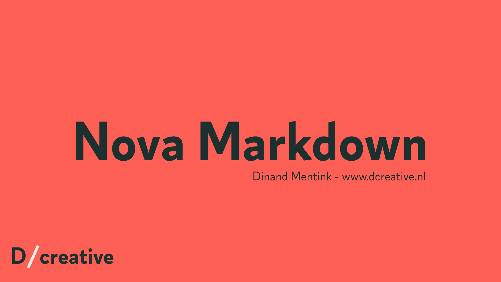
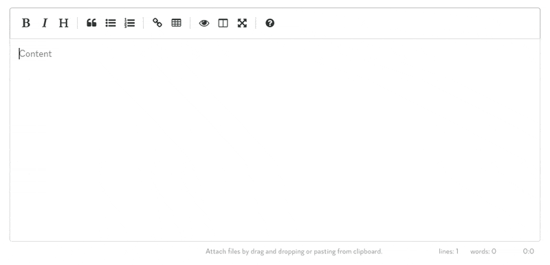

# Nova Markdown
[](https://packagist.org/packages/dinandmentink/nova-markdown)
[](https://packagist.org/packages/dinandmentink/nova-markdown)


[](https://paypal.me/dinandmentink)

Add a markdown editor field to Laravel Nova. Based on [easymde](https://easymde.tk), Nova Markdown supports highlighting, some useful buttons and inline image uploads. It's simple, configurable, and it just works™.



## Installation instructions
Require `dinandmentink/nova-markdown` using composer:

```bash
composer require dinandmentink/nova-markdown
```

The package will register itself using Laravels' package autodiscovery. Now, whenever you want to use a Markdown field use `Markdown::make` like you would expect in the `fields()` method of a Nova resource.

```php
use DinandMentink\Markdown\Markdown;

public function fields(Request $request)
{
    return [
        Markdown::make("Field Name"),
    ];
}
```

It will accept all default Nova options:

```php
use DinandMentink\Markdown\Markdown;

public function fields(Request $request)
{
    return [
        Markdown::make("Content")->rules('required')->hideFromIndex(),
    ];
}
```

## Versioning
Nova Markdown uses [semantic versioning](https://semver.org/) and aims to always support the latest major Laravel and Laravel Nova release. 

Only the latest major version for Nova Markdown will receive updates, it is recommended to upgrade to the latest version of Nova Markown whenever a new major version for Laravel or Laravel Nova drops. 

| Nova Markdown | Laravel | Laravel Nova | Maintenance              |
|:--------------|:--------|:-------------|:-------------------------|
| v4.x          | v9.x    | v4.x         | Features, Security, Bugs |
| v3.x          | v9.x    | v3.x         | Security                 |
| v2.x          | v8.x    | v3.x         | None                     |

## Image uploads
Nova Markdown supports inline image uploads. To upload an image you can drag-and-drop it onto the markdown editor. Alternatively, pasting an image from your clipboard will also work. 

Image upload is enabled by default for all `Markdown` fields. It can be disabled entirely, or by default, through the config. Image upload can be enabled or disabled on a per-field basis, but this will *only* toggle the frontend implementation of image uploads. 

```php
use DinandMentink\Markdown\Markdown;

public function fields(Request $request)
{
    return [
        Markdown::make("Field With Uploads")->uploads(),
        Markdown::make("Field Without Uploads")->uploads(false),
    ];
}
```

Image upload should just work™. Nova Markdown aims to support image uploads on a vanilla laravel + nova project. The following assumptions must be met. It's possible to override most of these through the config.

- A disk named `public` is assumed to be configured in `filesystems.php`.
- Nova Markdown uses [spatie/image](https://github.com/spatie/image) for compressing and resizing images. Image requires the php [exif extension](http://php.net/manual/en/exif.installation.php) to be enabled.
- Nova Markdown registers a route and a controller in the same middleware configured in `nova.middleware`. This assumes an authenticated user that may access Nova may also upload images through Nova Markdown's image upload route.

## Config
Config mainly deals with image uploads. Sensible defaults are provided, but Nova Markdown aims to be fully configurable either through `config/nova-markdown.php` or env variables.  

For all configuration options please see the [default config](src/config/nova-markdown.php), which can be published:

```bash
php artisan vendor:publish --provider="DinandMentink\Markdown\FieldServiceProvider"
```

This will create a `config/nova-markdown.php` file in your app that you can modify to set your configuration. Please make sure you check for changes to the original config file in this package between releases. The following are some of the most usefull config items.

**Enable uploads**

Config key: `uploads`  
ENV: `NOVA_MARKDOWN_UPLOADS`  
Default: `true`

Setting this to `false` will disable image uploads completely.

**Enable uploads by default** 

Config key: `uploads-default-enabled`  
ENV: `NOVA_MARKDOWN_UPLOADS_DEFAULT_ENABLED`  
Default: `true`

Will enable uploads by default (to be enabled on a per-field basis). Has no effect when uploads are disabled entirely. 

**Set disk**

Config key: `disk`  
ENV: `NOVA_MARKDOWN_DISK`  
Default: `public`

Set the disk where uploads are stored. Must be configured in `filesystems.php`.

**Directory**

Config key: `directory`  
ENV: `NOVA_MARKDOWN_DIRECTORY`  
Default: `uploads`

Set the directory where images are uploaded. Alternatively, it's possible to configure a function, which takes the uploading $user as argument and can be used to group files by user. Example:

```php
function($user) { 
    return "uploads/" . \Str::slug($user->name); 
}
```

**Maximum upload size**

Config key: `max-size`  
ENV: `NOVA_MARKDOWN_MAX_SIZE`  
Default: `8 * 1024`

The maximum size for uploaded images in kilobytes.

**Maximum upload width**

Config key: `max-width`  
ENV: `NOVA_MARKDOWN_MAX_WIDTH`  
Default: `1920`

The maximum width for uploaded images in pixels. Uploaded images will be scaled down to this width. Use null to disable image scaling.

**Image Quality**

Config key: `quality`  
ENV: `NOVA_MARKDOWN_QUALITY`  
Default: `85`

Uploaded images will be converted to this quality. Integer between 0 and 100. Use `null` to disable quality adjustments.

**Random Filename**

Config key: `random_filename`  
ENV: `NOVA_MARKDOWN_RANDOM_FILENAME`  
Default: `false`

Uploaded images will be stored by default using a slug version of its original filename. You can set this to true to use a random filename instead.

## Security
If you discover any security related issues, please email [dinand@dcreative.nl](mailto:dinand@dcreative.nl) instead of using the issue tracker.

## Rendering markdown
Nova Markdown will add a markdown editor field to Nova. It does not render markdown outside Nova. For rendering the markdown in Laravel views I recommend having a look at [Laravel Markdown](https://github.com/GrahamCampbell/Laravel-Markdown) or [commonmark](https://github.com/thephpleague/commonmark).

## Difference with Nova's own markdown
Nova, ofcourse, offers it's own [markdown field](https://nova.laravel.com/docs/1.0/resources/fields.html#markdown-field). Nova's official markdown and this, Nova Markdown, are similar. Both of them offer inline text highlighting of markdown text. Neither of them perform transformations on the input and simply store it as plain text, usually in a TEXT column. 

This package however will add some more highlighting and toolbar buttons that are not included the default Markdown field. But mainly, **Nova Markdown handles image uploads**. 

| Functionality | Default Markdown | Nova Markdown |
| --- | --- | --- |
| Strong | V | V |
| Italic | V | V |
| External image | V | V |
| Link | V | V |
| Preview | V | V |
| Inline image upload | - | V |
| Headings | - | V |
| Blockquotes | - | V |
| Ordered lists | - | V |
| Unordered lists | - | V |
| Side-by-side view | - | V |

## Credits


This project is proudly created and maintained by [Dcreative](https://www.dcreative.nl). Dcreative is a tiny webdevelopmment agency in the Netherlands. 

I have benefited a lot from PHP, Laravel, and countless other open source projects. Nova Markdown is my small contribution in return. Has Nova Markdown been useful to you? Feel free to drop me a [thank-you note](mailto:dinand@dcreative.nl) or [donate a beer](https://paypal.me/dinandmentink). Regardless, I'm happy to provide Nova Markdown.

*First version based on [@palauaandsons](https://github.com/palauaandsons/nova-simplemde-field/)*
